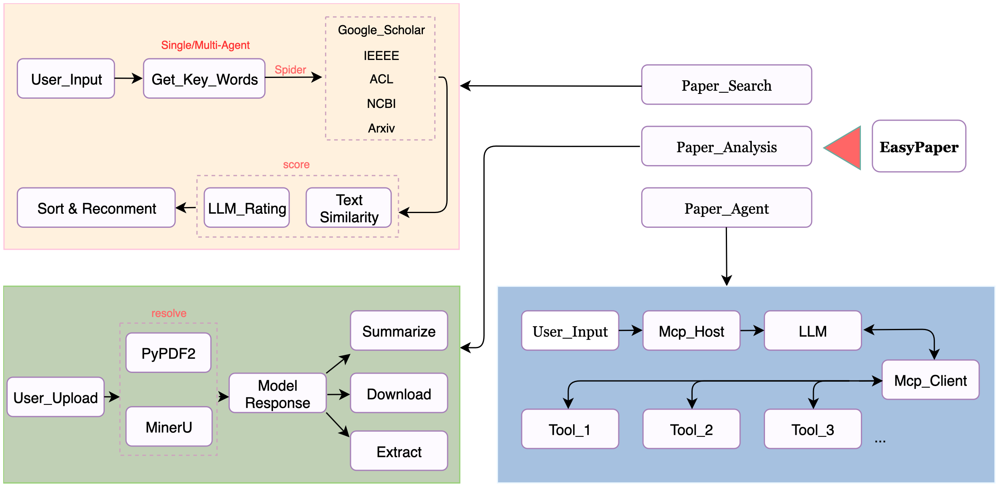

<h1 align="center">EasyPaper: Only Search and Analyze</h1>

    

### 📖 EasyPaper is an efficient literature search and analysis tool.

Introducing our powerful tool designed to streamline your literature research process.

### 🌟 Overall Architecture

    

### 📝 Key Features

#### ✨ Smart Literature Search
- Provide your search requirements and keywords to retrieve the most relevant papers from arXiv, IEEE, and SciHub.
- Requires registration with a model provider and API key.

- Currently supports DeepSeek and Silicon Flow models (more options coming soon).

- **Note**: Larger models deliver better analysis but require more processing time.

#### ✨ Single/Multiple Document Analysis

- Upload PDFs and interact with our AI model to get answers to your questions.

- Multiple PDF parsing options available.

- MinerU Parser: Delivers detailed analysis and supports image extraction (slower processing).

### 🎉 News
- 🎁2025.07.12: Several major updates 
- 1) 🔥 All the crawler code is open source — feel free to use it for your own projects or further development!
- 2) 🔥 Paper download functionality is included, with support for IEEE and arXiv — you can find the implementation in the code.
- 3) 🔥 Multi-agent systems are used to improve problems like inconsistent keyword extraction and scoring output formats — _langgraph_.
- 4) 🔥 The integration of MCP enables the development of a more advanced paper retrieval tool through its service capabilities.

### 🛠️ Try It Now

Is there a way for me to experience it?

**⚠️ Some Brothers, Some ⚠️**

You can experience the full functionality through our cloud deployment:
🔗 **[Try it here](http://47.122.37.248:65523/)**  

Welcome all feedback and issue reports on GitHub - your input will guide our future optimizations. This is just the beginning - we're committed to continuously improving the tool to revolutionize literature research.
### 🚀 Acknowledgments
Special thanks to **SSW**, **GBS** and other open projects for their valuable contributions. Interested in joining our development team? Feel free to reach out!
